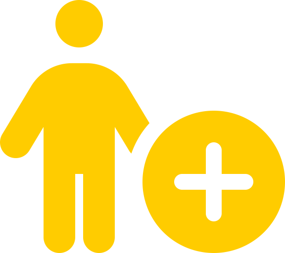
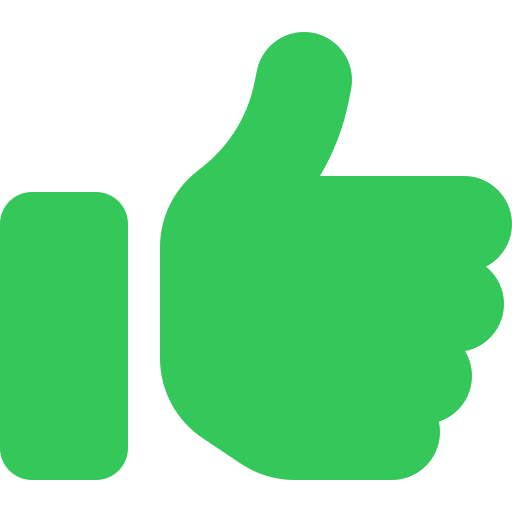

.. Author: Akshay Mestry <xa@mes3.dev>
.. Created on: Friday, August 16, 2024
.. Last updated on: Saturday, September 01 2024

:orphan:

.. announcement:: We're excited to share this new iteration of our site,
    designed with enhanced automation and a fresh, user-friendly
    interface. Please note that the site is currently under construction, and
    some features may be in development.

.. image:: _static/img/logo.png
    :scale: 35%
    :align: center
    :alt: SCHOOL Main Logo

===============================================================================
SCHOOL
===============================================================================

-------------------------------------------------------------------------------
TOPST Science Core Heuristics for Open Science Outcomes in Learning
-------------------------------------------------------------------------------

**Science Core Heuristics for Open Science Outcomes in Learning** (`SCHOOL`_),
is an integral part of |website-tops| Training initiative. Our mission is to
cultivate a vibrant, inclusive culture of open science that welcomes everyone
|html-dash| students, researchers, and curious minds alike |html-dash| to
engage, learn, and contribute to the world of scientific discovery.

The :term:`SCHOOL` curriculum is a thoughtfully designed program that offers
five immersive, 2.5-hour learning modules. These sessions are more than just
lessons |html-dash| they are interactive, interdisciplinary journeys through
some of the most critical themes of our time. Whether it's exploring the
intricacies of **water systems**, **health** and **air quality**,
**environmental justice**, **natural disasters**, **climate change**,
**agriculture**, or the challenges posed by **wildfires**, our curriculum
weaves together these diverse topics with a common thread, the importance of
`Open Science`_.

-------------------------------------------------------------------------------
Open Science, Open Minds
-------------------------------------------------------------------------------

In each module, you'll find a rich blend of lessons that are not only
informative but also transformative. We dive deep into Earth Science
Applications, offering real-world use cases that show you how to access and
analyze vast data sources. These lessons are rooted in the principles of
:term:`FAIR` data management |html-dash| ensuring that the scientific data you
work with is **Findable**, **Accessible**, **Interoperable**, and
**Reusable**. By learning to navigate these open data science lifecycle
workflows, you're not just gaining knowledge; you're acquiring the tools to
make meaningful contributions to the global scientific community.

.. tip::

    The :term:`SCHOOL` program covers a wide range of topics. Don't feel
    overwhelmed if you're new to some of them. Take your time with each
    module, and remember that learning is a continuous process. There are
    plenty of resources and a supportive community to help you along the way.

-------------------------------------------------------------------------------
Inclusive Learning and Engaging
-------------------------------------------------------------------------------

At the heart of :term:`SCHOOL` is a commitment to inclusive teaching. We
believe that diversity enriches the learning experience, and our curriculum
reflects this belief. By incorporating a variety of examples that transcend
gender, cultural, and socioeconomic barriers, we ensure that every student
feels represented and valued. Our content is delivered in multiple modes
|html-dash| visual, textual, and interactive |html-dash| so that everyone,
regardless of their background or prior experience, can engage fully and
comfortably.

**Active learning** is another cornerstone of our approach. We encourage you
to go beyond passive listening. Whether you're reading, discussing, executing
code, or writing, we want you to think critically about what you're doing. In
our asynchronous learning environments, you won't just be watching a video;
you'll be asked to engage |html-dash| look at an image, interact with your
surroundings, or draw on your past experiences. This hands-on, minds-on
approach ensures that learning is both dynamic and deeply personal.

-------------------------------------------------------------------------------
Clear Pathways to Success
-------------------------------------------------------------------------------

To support our inclusive and active learning strategies, we emphasize the
importance of clear, transparent **evaluations**. We believe that everyone
should know exactly what is expected of them and how they will be assessed.
That's why we provide clear learning objectives, timely assessments, and
examples of what success looks like. By offering feedback early and often, we
ensure that you're never left guessing about your progress. Instead, you'll
have a clear roadmap to follow, with plenty of opportunities to improve and
succeed along the way.

-------------------------------------------------------------------------------
Join the Open Science Community
-------------------------------------------------------------------------------

We believe that open science thrives on collaboration and community. By
joining our network, you'll gain access to a wealth of resources, from the
latest research and data sets to exclusive invitations to workshops and
webinars. Whether you're a seasoned researcher or just starting your journey,
there's a place for you here.

.. image:: _documentation/_assets/title-glyphs/compass-solid.svg
    :align: center
    :width: 80px
    :alt: Title glyph

-------------------------------------------------------------------------------
Get Started
-------------------------------------------------------------------------------

This page will guide you through the essentials of Open Science, offering
resources and insights to enhance transparency and collaboration in research.
Prepare to join a global movement dedicated to advancing accessible and
impactful scientific research.

:doc:`Let's get started <_documentation/getting-started>` |chevron-right|

.. toctree::
    :hidden:
    :maxdepth: 1

    _documentation/getting-started
    _documentation/open-science-essentials

.. toctree::
    :hidden:
    :maxdepth: 1
    :caption: Supporting Articles

    glossary
    school-team
